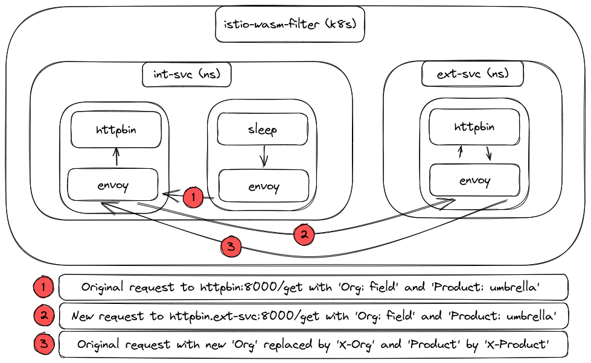

## WASM Plugin for Istio

### What it does?

This filter will inject a service call in the normal request flow to gather information and translate based on given configuration.
The example currently uses an external `httpbin` service to map from values `Org` and `Product` to `X-Org` and `X-Product`.



### What is required?

* make
* tinygo
* docker
* kind
* kubectl
* istioctl

### How to test?

`make deploy`

### Does it impact performance?

With Plugin:

```
Summary:
  Total:        1.3130 secs
  Slowest:      0.1206 secs
  Fastest:      0.0104 secs
  Average:      0.0632 secs
  Requests/sec: 761.6342

  Total data:   701000 bytes
  Size/request: 701 bytes

Response time histogram:
  0.010 [1]     |
  0.021 [19]    |■■
  0.032 [24]    |■■
  0.043 [35]    |■■■
  0.054 [101]   |■■■■■■■■■
  0.065 [431]   |■■■■■■■■■■■■■■■■■■■■■■■■■■■■■■■■■■■■■■■■
  0.077 [218]   |■■■■■■■■■■■■■■■■■■■■
  0.088 [138]   |■■■■■■■■■■■■■
  0.099 [21]    |■■
  0.110 [2]     |
  0.121 [10]    |■


Latency distribution:
  10% in 0.0467 secs
  25% in 0.0569 secs
  50% in 0.0621 secs
  75% in 0.0727 secs
  90% in 0.0818 secs
  95% in 0.0848 secs
  99% in 0.1115 secs

Details (average, fastest, slowest):
  DNS+dialup:   0.0001 secs, 0.0104 secs, 0.1206 secs
  DNS-lookup:   0.0001 secs, 0.0000 secs, 0.0027 secs
  req write:    0.0000 secs, 0.0000 secs, 0.0011 secs
  resp wait:    0.0629 secs, 0.0094 secs, 0.1205 secs
  resp read:    0.0001 secs, 0.0000 secs, 0.0019 secs

Status code distribution:
  [200] 1000 responses
```

Without Plugin: 

```
Summary:
  Total:        0.9129 secs
  Slowest:      0.0788 secs
  Fastest:      0.0027 secs
  Average:      0.0443 secs
  Requests/sec: 1095.4093

  Total data:   661000 bytes
  Size/request: 661 bytes

Response time histogram:
  0.003 [1]     |
  0.010 [9]     |
  0.018 [8]     |
  0.026 [21]    |■
  0.033 [23]    |■
  0.041 [75]    |■■■■
  0.048 [743]   |■■■■■■■■■■■■■■■■■■■■■■■■■■■■■■■■■■■■■■■■
  0.056 [88]    |■■■■■
  0.064 [9]     |
  0.071 [4]     |
  0.079 [19]    |■


Latency distribution:
  10% in 0.0381 secs
  25% in 0.0430 secs
  50% in 0.0447 secs
  75% in 0.0467 secs
  90% in 0.0496 secs
  95% in 0.0533 secs
  99% in 0.0782 secs

Details (average, fastest, slowest):
  DNS+dialup:   0.0001 secs, 0.0027 secs, 0.0788 secs
  DNS-lookup:   0.0001 secs, 0.0000 secs, 0.0022 secs
  req write:    0.0000 secs, 0.0000 secs, 0.0016 secs
  resp wait:    0.0441 secs, 0.0026 secs, 0.0788 secs
  resp read:    0.0001 secs, 0.0000 secs, 0.0011 secs

Status code distribution:
  [200] 1000 responses
```

